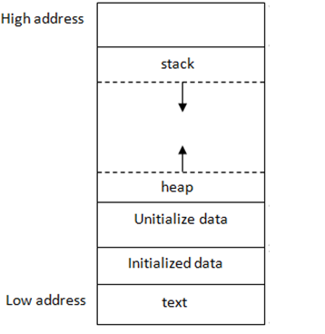

C Programming for Python Programmers
====================================

This training will cover:

1. Types, operators, and expressions
2. Branching and iteration
3. Functions
4. Scope and extent
5. Pointers
6. Arrays and strings
7. Dynamic memory
8. Structures
9. GDB

Hello World
-----------

.. code-block:: c

    #include <stdio.h>

    int main(void)
    {
         printf("Hello World\n");
         return 0;
    }

All C programs have `main()` as the entry-point function. The braces indicate
the extent of the function block. When a function completes, the program
returns to the calling function. In the case of `main()`, the program
terminates and control returns to the environment in which the program was
executed. The integer return value of `main()` indicates the program's exit
status to the environment, with 0 meaning normal termination.

C is a free-form language: in most cases, programs are not affected by
whitespace. A statement is terminated by a semicolon, not a newline.

Compiling and Running a Program in C
------------------------------------

Compiling:

.. code-block:: bash

    gcc program.c -o program

Running:

.. code-block:: bash

    ./program

Variables and Types
-------------------

C is a typed language. Every variable in C is assigned a distinct type that
dictates the range of values it can hold, how its data is stored in memory,
and the permissible operations that can be performed on it.

.. list-table:: Common C data types (typical sizes)
    :header-rows: 1

    * - Type
      - Size (bytes)
    * - char
      - 1
    * - int
      - 4
    * - short int
      - 2
    * - long int
      - 8
    * - float
      - 4
    * - double
      - 8
    * - long double
      - 16

All variables must be declared before they are used. They are typically
declared at the top of a block (a section of code enclosed in `{` and `}`)
before statements in introductory examples.

Signed and Unsigned Variables
^^^^^^^^^^^^^^^^^^^^^^^^^^^^^

A signed type can represent negative values (default option). The
most-significant bit (MSB) of a signed number is its sign bit, and the value
is typically encoded in two's complement binary. An unsigned type is always
non-negative, and the MSB is part of the numeric value, doubling the maximum
representable value compared to an equivalent signed type.

For example, a 16-bit signed short can represent numbers from $-2^{15}$ to
$2^{15} - 1$ (i.e. -32768 to 32767), while a 16-bit unsigned short can
represent numbers from $0$ to $2^{16} - 1$ (i.e. 0 to 65535).

Operators
---------

The syntax for arithmetic and relational operators in C is similar to Python
in many cases. Logical operators differ:

.. list-table:: Logical operators
    :header-rows: 1

    * - Python
      - C
    * - `and`
      - ``&&``
    * - `or`
      - ``||``

Branching
---------

If Condition
^^^^^^^^^^^^

Python:

.. code-block:: python

    if condition:
         # body of if statement

C:

.. code-block:: c

    if (condition) {
         /* body of if statement */
    }

The main difference is that in C the condition is enclosed in parentheses and
the body is enclosed in curly braces.

If-Else Ladder
^^^^^^^^^^^^^^

Python:

.. code-block:: python

    if condition:
         # body of if statement
    elif condition:
         # body of else-if statement
    else:
         # body of else statement

C:

.. code-block:: c

    if (condition) {
         /* body of if statement */
    }
    else if (condition) {
         /* body of else-if statement */
    }
    else {
         /* body of else statement */
    }

The same logic applies, with `elif` replaced by `else if`.

Conditional Expression
^^^^^^^^^^^^^^^^^^^^^^

.. code-block:: c

    variable = (condition) ? expression1 : expression2;

The conditional expression (ternary operator) is available in C. If the
condition evaluates to true, the first expression is selected; otherwise the
second expression is selected.

Switch Statement
^^^^^^^^^^^^^^^^

.. code-block:: c

    switch (value) {
         case value1:
              /* case body */
              break;

         case value2:
              /* case body */
              break;

         default:
              /* case body */
              break;
    }

In a `switch` statement, the block whose case value matches the switch
expression is evaluated. The `break` statement after each case is important;
otherwise execution falls through to subsequent cases.

Loops
-----

In Python, loops are often used to iterate directly over data structures. In
C, loops are commonly used as control structures based on expression
evaluation.

C also offers a `do-while` loop. While `for` and `while` are entry-controlled
(condition checked before entering the body), `do-while` is exit-controlled
(condition checked after the body executes). Therefore, a `do-while` loop runs
at least once.

.. image:: ../../../fig/forloop.png
    :alt: for loop

.. image:: ../../../fig/whileloop.png
    :alt: while loop

.. image:: ../../../fig/dowhileloop.png
    :alt: do-while loop

Pointers
--------

A pointer is a variable whose value is a memory address.

.. image:: ../../../fig/pointers.png
    :alt: pointer memory diagram

Let `x` be an integer variable initialized to 10:

.. code-block:: c

    int x = 10;

An integer typically takes 4 bytes of memory. If the first byte is stored at
address `0x00`, then the last byte is at `0x03`. An integer pointer can store
the address of an integer variable:

.. code-block:: c

    int *ptr = &x;

If `x` begins at address `0x00`, then `ptr` has value `0x00`.

Pointer Arithmetic
------------------

.. image:: ../../../fig/pointers_arith_int.png
    :alt: pointer arithmetic with int

.. image:: ../../../fig/pointers_arith_char.png
    :alt: pointer arithmetic with char

Dynamic Memory
--------------

C has five distinct areas of memory:

Text segment
    Once the program is compiled, a binary file is produced and loaded into RAM
    when executed. Machine instructions are stored in the text segment, which is
    typically read-only to prevent accidental modification.

Initialized data segment
    Holds values of external, global, static, and constant variables initialized
    at declaration. This segment is typically read-write for mutable data.

Uninitialized data segment (BSS)
    Allocated at program load time. Data in BSS is initialized to arithmetic
    zero (and pointers to null) before program execution. This includes static
    and global variables initialized to zero.

Stack
    Used for local variables. Memory is allocated when variables come into scope
    and released when they go out of scope. The stack follows a last-in,
    first-out (LIFO) discipline and is managed by the compiler/runtime.

Heap
    Used for dynamic allocation and managed explicitly by the programmer via
    standard library allocation/deallocation functions. It offers flexibility,
    but also requires careful memory management.

In order to allocate memory dynamically on the heap, we can use the `malloc` function from the C standard library. The `malloc` function takes a single argument that specifies the number of bytes to allocate and returns a pointer to the allocated memory. For example, to allocate an array of 10 integers, we can use the following code:
.. image:: ../../../fig/malloc.png
    :alt: malloc diagram

In this example, `malloc` allocates 4 bytes of memory and returns a pointer to the first byte of the allocated memory. We can then use this pointer to access the allocated memory as an array of integers. 

.. image:: ../../../fig/dynamic_mem.png
    :alt: dynamic memory diagram

However, hard coding the size of the array is not ideal. Instead, we can use the `sizeof` operator to determine the size of the data type and calculate the total number of bytes needed for the array. For example, to allocate an array of `n` integers, we can use the following code:

.. code-block:: c

    int n = 10; // or any desired size
    int *arr = (int *)malloc(n * sizeof(int));

This allocates enough memory for `n` integers and returns a pointer to the allocated memory. It is important to check if `malloc` returns `NULL`, which indicates that the allocation failed due to insufficient memory. 

..code-block:: c

    if (arr == NULL) {
         // handle allocation failure
    }

After we are done using the dynamically allocated memory, we should free it using the `free` function to avoid memory leaks:

.. code-block:: c

    free(arr);

Array
-----

In C, there is a strong relationship between pointers and arrays. Any operation that can be achieved by array subscripting can also be achieved by pointer arithmetic.

Here we define an array of 4 integers:
.. image:: ../../../fig/array_int.png
    :alt: integer array diagram

Note that the array elements are stored contiguously in increasing address order. The name of the array (e.g. `arr`) is a pointer to the first element of the array (i.e. `&arr[0]`). 
This is known as the array-to-pointer decay. Therefore, `arr` and `&arr[0]` are equivalent. We can also use pointer arithmetic to access array elements. For example, `*(arr + 2)` is equivalent to `arr[2]` and gives us the value of the third element of the array.

Likewise, we can define an array of characters (i.e. a string):
.. image:: ../../../fig/array_char.png
    :alt: character array diagram

As such there is no built-in string type in C. Instead, strings are represented as arrays of characters terminated by a null character (`'\0'`), which indicates the end of the string. The same as array of integers, the name of the array (e.g. `str`) is a pointer to the first character of the string (i.e. `&str[0]`). Therefore, `str` and `&str[0]` are equivalent. We can also use pointer arithmetic to access characters in the string. For example, `*(str + 4)` is equivalent to `str[4]` and gives us the value of the fifth character of the string.

Multidimensional Arrays
----------------------
In C, multidimensional arrays are stored in row-major order. This means that the elements of the first row are stored contiguously in memory, followed by the elements of the second row, and so on. For example, a 2D array of integers with 2 rows and 4 columns is stored as follows:
.. image:: ../../../fig/array_multi.png
    :alt: multidimensional array diagram

Clearly, an array in C is homogenenous: all elements must be of the same type. If we want to store different types of data together, we can use structures instead.

As discussed before, local arrays are often allocated on the stack, so their maximum size is limited by available stack space. In C, many arrays have a compile-time constant size, but C can also support variable-length arrays whose size is determined at runtime (where supported). If you need an array that is very large or whose size must be chosen or resized at runtime, you can allocate it dynamically on the heap using malloc (and optionally realloc to resize). In that case, you typically use a pointer variable (often a local variable) to store the address of the heap-allocated array.
For example, we can create a dynamic array of integers as follows:

.. image:: ../../../fig/dynamic_mem_arr.png
    :alt: dynamic array diagram

Functions
---------

.. image:: ../../../fig/functions.png
    :alt: functions diagram

Structure
---------

.. image:: ../../../fig/structures.png
    :alt: structures diagram

Stages of Compiling
-------------------

.. image:: ../../../fig/compiler.png
    :alt: compiler stages

